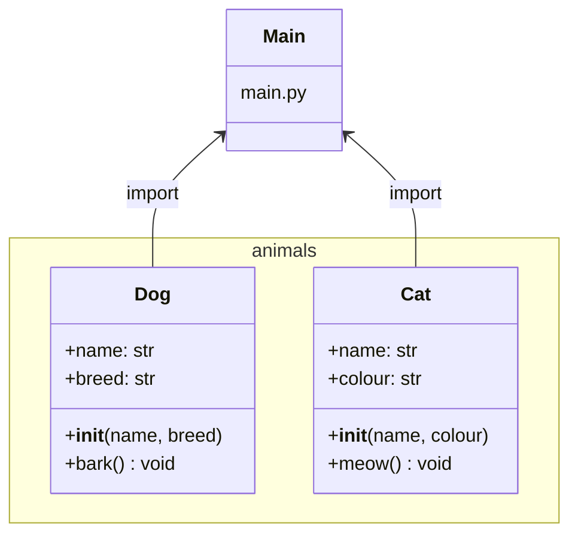

# Modules and packages

Program structure is an important part of software design. A well-structured program is easier to understand, maintain and extend. In Python a program can be divided into smaller parts such as modules and packages. This becomes especially important in larger projects where there is a lot of code and multiple developers work together.

Applying a module structure is recommended for the course programming project.

## Module

In Python a module is a single file with the `.py` extension. A module lets you write functions, classes and variables in one place and reuse them in other programs. For example, suppose we want to implement addition and subtraction. We could create a file named `math_utils.py` and write the following functions:

```python
def add(x, y):
    return x + y

def sub(x, y):
    return x - y
```

When this file exists we can import it in a main program using the `import` statement and call its functions. In this way the module acts as a toolbox that can be used anywhere:

```python
import math_utils
print(math_utils.add(2, 3))  # Prints: 5
```

## Package

If there are multiple modules that you want to group together, you create a package. A package is simply a directory that contains modules and usually an `__init__.py` file. The `__init__.py` file can be empty, but its presence tells Python that the directory is a package rather than an ordinary folder. Packages let you build larger libraries composed of several modules and even subpackages.

Imagine we build a package called `animals`. The directory structure could look like this:

```directory
project/
│
├── main.py
└── animals/           ← package
    ├── __init__.py    ← package initialization
    ├── dog.py         ← module
    └── cat.py         ← module
```

In `dog.py` we might have a function:

```python
def bark():
    print("Woof!")
```

And `cat.py` could contain:

```python
def meow():
    print("Meow!")
```

In `__init__.py` we can write:

```python
from .dog import bark
from .cat import meow
```

(From Python 3.3 onward `__init__.py` is not strictly required, but it is useful for defining package behavior.)

This allows importing `bark` and `meow` directly from the `animals` package. In `main.py` it is sufficient to write:

```python
from animals import bark, meow

bark()
meow()
```

When the program runs it prints the dog's bark followed by the cat's meow. This example demonstrates how modules and packages help organize code so it becomes clearer, more reusable and easier to maintain.

Classes can also be defined inside modules and packages, which enables using object-oriented principles in larger code bases.

`dog.py`:

```python
class Dog:
    def __init__(self, name, breed):
        self.name = name
        self.breed = breed

    def bark(self):
        print(f"{self.name} barks: Woof woof!")
```

`cat.py`:

```python
class Cat:
    def __init__(self, name, colour):
        self.name = name
        self.colour = colour

    def meow(self):
        print(f"{self.name} says: Meow!")
```

`__init__.py`:

```python
from .dog import Dog
from .cat import Cat
```

This makes it possible to import `Dog` and `Cat` classes directly from the package without referring to individual module files.

`main.py`:

```python
from animals import Dog, Cat

dog1 = Dog("Rex", "Labrador")
cat1 = Cat("Misty", "Black")

dog1.bark()
cat1.meow()
```

When the program runs, the output is:

```output
Rex barks: Woof woof!
Misty says: Meow!
```

In this example, the `animals` package contains two classes that can be easily used in the main program or other modules.



A single module can also be executed as a main program. For example, the `dog.py` file can be run directly to test its behavior without running the whole project. To enable this, the module includes the following `if` statement:

```python
class Dog:
    def __init__(self, name, breed):
        self.name = name
        self.breed = breed

    def bark(self):
        print(f"{self.name} barks: Woof woof!")

if __name__ == "__main__":
    dog = Dog("TestRex", "Labrador")
    dog.bark()
```

Now, running `dog.py` directly prints: `TestRex barks: Woof woof!`. If the module is imported into another program, the test code is not executed.

<!-- add mermaid support for gh pages -->
<script type="module">
    Array.from(document.getElementsByClassName("language-mermaid")).forEach(element => {
      element.classList.add("mermaid");
    });
    import mermaid from 'https://cdn.jsdelivr.net/npm/mermaid@11/dist/mermaid.esm.min.mjs';
    mermaid.initialize({ startOnLoad: true });
</script>
