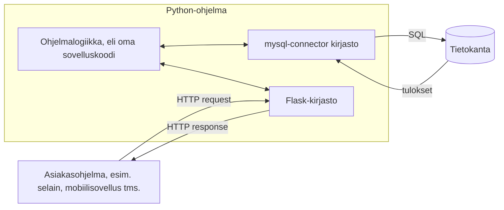

# Taustapalvelun ja rajapinnan rakentaminen

Tässä moduulissa opit toteuttamaan Python-kielisen taustapalvelun (*backend*). Tällöin voit rakentaa web-palvelun siten, että web-sovelluksen HTML-/CSS-/JavaScript-käyttöliittymä kommunikoi Python-kielisen taustapalvelun tarjoamien HTTP-päätepisteiden (*endpoint*) kanssa.

Taustapalvelun käyttäjän ei välttämättä tarvitse olla selain. Tässä opittavalla lähestymistavalla toteutettavaa taustapalvelua voi käyttää HTTP-yhteyskäytännön ansiosta ohjelmallisesti mistä tahansa palvelusta, millä tahansa ohjelmointikielellä.

Moduulin harjoituksissa toteutetaan yksinkertainen Python-kielinen taustapalvelu, jolla haetaan tietoja MariaDB-tietokannasta. Taustapalvelu tarjoaa HTTP-päätepisteen, jota web-sovelluksen käyttöliittymä voi käyttää tietojen hakemiseen. Päätepiste toteutetaan Flask-kirjaston avulla.



## Flask-kirjaston asennus

Python-ohjelmasta rakennetaan taustapalvelu Flask-kirjaston avulla. Flask tarjoaa mahdollisuuden päätepisteiden ohjelmointiin. Ulkoinen ohjelma (esimerkiksi verkkoselain) voi käyttää noita päätepisteitä ja sitä kautta suorittaa taustapalveluun ohjelmoitua toiminnallisuutta.

Tarkastellaan esimerkkiä, jossa teemme taustapalvelun, joka laskee kaksi saamaansa lukua yhteen. Tällaiseen laskentaan ei toki taustapalvelua tarvittaisi, mutta tarkoitus onkin havainnollistaa taustapalvelun toteuttamiseen tarvittavia tekniikoita yksinkertaisen esimerkin kautta.

Aloitetaan Flask-kirjaston asentamisesta. Asennus on helppo tehdä suoraan **PyCharm**-kehittimestä:

1. Valitse **View / Tool Windows / Python Packages**.
2. Kirjoita hakukenttään **Flask**. Valitse avautuvasta listasta **Flask**-vaihtoehto ja napsauta **Install**.

**Visual Studio Code** -kehittimessä asennus onnistuu avaamalla terminaali ja kirjoittamalla komento: `python -m pip install flask`.

Kirjasto on tämän jälkeen heti käytössä.

## Päätepisteen kirjoitus

Kun Flask on asennettu, voimme kirjoittaa ensimmäisen version ohjelmasta tiedostoon `summapalvelu.py`:

```python
from flask import Flask, request

app = Flask(__name__)
@app.route('/summa')
def summa():
    args = request.args
    luku1 = float(args.get("luku1"))
    luku2 = float(args.get("luku2"))
    summa = luku1 + luku2
    return str(summa)

app.run(use_reloader=True, host='127.0.0.1', port=3000)
```

Aloitetaan ohjelmaan perehtyminen sen viimeisestä rivistä. Sillä oleva `app.run`-metodin kutsu käynnistää taustapalvelun. Palvelu avataan IP-osoitteessa 127.0.0.1, joka on omaa tietokonetta vastaava erikoisosoite. Tämä tarkoittaa, että yhteys tuohon IP-osoitteeseen voidaan ottaa vain samasta tietokoneesta, jossa ohjelmaa ajetaan. Porttinumero 3000 kertoo, että taustapalvelin odottaa mainittuja saman koneen yhteydenottoja tietoliikenneportin 3000 kautta.

Ohjelman rivi `@app.route('summa')` määrittää niin kutsutun päätepisteen. Se kertoo, että seuraavan rivin funktio nimeltä `summa` ajetaan silloin, kun taustapalvelun käyttäjä lähettää pyynnön, jossa IP-osoiteosan jälkeen esiintyy merkkijono `/summa`. Funktiota voidaan siis kutsua esimerkiksi selaimesta kirjoittamalla verkko-osoitteeksi `http://127.0.0.1:3000/summa`. Teknisesti selain lähettää tällöin HTTP-yhteyskäytännön mukaisen GET-pyynnön, johon Flaskin avulla toteutettu taustapalvelu vastaa.

Edellä kuvattu kutsu ei aivan riitä summan laskemiseen, sillä kutsun yhteydessä on myös määritettävä summan yhteenlaskettavat. Ne voidaan välittää GET-pyynnön parametreina, jotka käsitellään `request`-kirjaston `args.get`-metodin avulla.

Näin taustapalvelua voidaan kutsua kirjoittamalla selaimeen vaikkapa osoite `http://127.0.0.1:3000/summa?luku1=13&luku2=28`. Ensimmäinen parametri, eli liukuluvuksi muunnettu parametri "13" päätyy `luku1`-muuttujan arvoksi. Vastaavasti toinen parametri, merkkijono "28" muutetaan liukuluvuksi ja annetaan muuttujan `luku2` arvoksi. Summa lasketaan, ja se muunnetaan merkkijonoksi sekä palautetaan funktion paluuarvona.

Kun taustapalvelua kutsutaan selaimesta, vastauksena oleva luku nähdään selainikkunassa (kuvan porttinumero poikkeaa esimerkissä käytetystä):


Taustapalvelu toimii nyt teknisesti, mutta tulos ei vielä ole sellaisessa muodossa, että sen ohjelmallinen käsittely olisi helppoa.

Huomioi, että palvelinohjelma on käynnissä siihen asti kunnes se lopetetaan joko tarkoituksella tai se kaatuu jonkin virhetilanteen seurauksena. Voit lopettaa ohjelman IDEn pysäytystoiminnolla tai painamalla terminaalissa `Ctrl+C`.

## JSON-vastauksen tuottaminen

Kun taustapalvelu palauttaa vastauksen selaimelle, halutaan vastaus antaa usein JSON-muodossa. JSON (*JavaScript Object Notation*) on esitysmuoto, joka mukailee JavaScript-kielen oliorakennetta. Rakenne on onneksi intuitiivinen myös Python-kielen olioihin tottuneelle kehittäjälle.

Muokataan esimerkin `summa`-funktiota siten, että se ei enää palauta merkkijonoa vaan tuottaa vastauksen JSON-muodossa. Muodon tuottamiseen onnistuu suoraan Pythonin sanakirjarakenteesta:

```python
from flask import Flask, request

app = Flask(__name__)
@app.route('/summa')
def summa():
    args = request.args
    luku1 = float(args.get("luku1"))
    luku2 = float(args.get("luku2"))
    summa = luku1 + luku2

    vastaus = {
        "luku1": luku1,
        "luku2": luku2,
        "summa": summa
    }

    return vastaus

app.run(use_reloader=True, host='127.0.0.1', port=3000)
```

Nyt ohjelma tuottaa JSON-vastauksen, jonka ohjelmallinen käsittely on helppoa vaikkapa selaimessa ajettavan JavaScript-kielen avulla (kuvan porttinumero poikkeaa esimerkissä käytetystä):


Edellä kuvatun yksinkertaisen taustapalvelun idean pohjalta on mahdollista rakentaa monipuolinen taustapalvelu, jossa on tarpeellinen määrä päätepisteitä.

## Pyynnön jäsentäminen

Edellä kuvatuissa esimerkeissä päätepisteeseen liittyvät parametriarvot annettiin HTTP-pyynnön parametreina, jotka eroteltiin domain- ja maaosasta kysymysmerkillä (`?`). Tämä on perinteinen tapa välittää parametreja HTTP-pyynnön yhteydessä.

Vaihtoehtoinen tapa on kuvata pyynnön kohteena oleva resurssi osana varsinaista verkko-osoitetta. Seuraava yksinkertainen esimerkki tuottaa "kaikupalvelun", joka palauttaa annetun merkkijonon JSON-rakenteessa kaiutettuna eli kahdennettuna. Esimerkissä merkkijonoa ei anneta parametrina vaan ikään kuin osana verkko-osoitetta. Flask tarjoaa suoraviivaisen tavan verkko-osoitteen osien käsittelyyn:

```python
from flask import Flask

app = Flask(__name__)
@app.route('/kaiku/<teksti>')
def kaiku(teksti):
    vastaus = {
        "kaiku": teksti + " " + teksti
    }
    return vastaus

app.run(use_reloader=True, host='127.0.0.1', port=3000)
```

Selaimessa palvelu näyttäytyy näin:


Taustapalvelun ohjelmoija voi täysin päättää, miten verkko-osoitteena domain-osan ja maatunnuksen jälkeinen osa käsitellään. Erityisesti REST-arkkitehtuurityylissä suositaan lähestymistapaa, jossa käsiteltävä resurssi kuvataan viimeksi esitellyllä tavalla, osana verkko-osoitetta.

## Virhetilanteiden käsittely

Tarkastellaan aiempaa summan laskentaesimerkkiä, jota on muunnettu siten, että molemmat yhteenlaskettavat annetaan osana osoitepolkua. Kelvollinen pyyntö voidaan siis antaa esimerkiksi seuraavasti: `http://127.0.0.1:3000/summa/42/117`.

Esimerkissä oletettiin, että käyttäjän lähettämä pyyntö on virheetön.

Jos virheenkäsittelyä ei erikseen ohjelmoida, ovat ainakin seuraavat virhetilanteet mahdollisia:

1. Käyttäjä yrittää kutsua virheellistä päätepistettä: `http://127.0.0.1:3000/sumka/42/117`
2. Käsittely ohjautuu oikeaan päätepisteeseen, mutta vastauksen tuottaminen epäonnistuu virheellisen yhteenlaskettavan vuoksi: `http://127.0.0.1:3000/summa/4t23/117`

Ensimmäisessä tapauksessa Flask-taustapalvelu palauttaa automaattisesti virhekoodin 404 (Not found). Jälkimmäisessä tapauksessa palautuu statuskoodi 500 (Internal server error). Pyynnön lähettäjä voi toki käsitellä nuo virheilmoitukset ohjelmallisesti. Taustapalvelun ohjelmoijina meidän on kuitenkin mahdollisuus käsitellä virhetilanteet samalla kun ne syntyvät ja tarjota palvelun käyttäjälle (asiakasohjelmalle) seikkaperäisempää tietoa virheen syystä.

Seuraava ohjelma käsittelee virhetilanteet edellä esitettyä yksityiskohtaisemmin:

1. Jos parametrin muunnos liukuluvuksi ei onnistu, tulostuu `{"status": 400, "teksti": "Virheellinen yhteenlaskettava"}`. Taustapalvelu palauttaa nyt kuvaavamman HTTP-statuskoodin 400 (Bad Request) eikä oletusarvoista koodia 500 (Internal server error).
2. Kutsu virheelliseen päätepisteeseen tuottaa statuskoodin 404 ja JSON-vastauksen `{"status": 404, "teksti": "Virheellinen päätepiste"}`.

Ohjelma lisää statuskoodin myös onnistuneesta operaatiosta rakennettavan vastauksen runkoon. Rungossa oleva statuskoodi on vain lisätiedoksi. Varsinainen HTTP-yhteyskäytännön mukainen statuskoodi annetaan `Response`-olion `statuscode`-parametrina.

Response-olio on luotava silloin, kun vastauksena palautetaan muutakin kuin paljas sanakirjarakenteesta tuotettu JSON ja oletusstatuskoodi 200. Response-oliota luotaessa määritetään ns. mime-tyyppi. Se antaa lisätietona selaimelle tiedon siitä, miten vastaus on tarkoitus tulkita. Response-oliota käytettäessä Flask ei myöskään muuta sanakirjarakennetta automaattisesti JSON-muotoon, vaan se on tehtävä erikseen. Tähän käytetään Pythonin sisäänrakennettua `json`-kirjastoa.

Laajennettu ohjelma on seuraavanlainen:

```python
from flask import Flask, Response
import json

app = Flask(__name__)
@app.route('/summa/<luku1>/<luku2>')
def summa(luku1, luku2):
    try:
        luku1 = float(luku1)
        luku2 = float(luku2)
        summa = luku1 + luku2

        tilakoodi = 200
        vastaus = {
            "status": tilakoodi,
            "luku1": luku1,
            "luku2": luku2,
            "summa": summa
        }

    except ValueError:
        tilakoodi = 400
        vastaus = {
            "status": tilakoodi,
            "teksti": "Virheellinen yhteenlaskettava"
        }

    json_vastaus = json.dumps(vastaus)
    return Response(response=json_vastaus, status=tilakoodi, mimetype="application/json")

@app.errorhandler(404)
def page_not_found(virhe):
    vastaus = {
        "status": "404",
        "teksti": "Virheellinen päätepiste"
    }
    jsonvast = json.dumps(vastaus)
    return Response(response=jsonvast, status=404, mimetype="application/json")

if __name__ == '__main__':
    app.run(use_reloader=True, host='127.0.0.1', port=3000)
```

Ensimmäinen virhetilanne käsitellään `try`-`except`-rakenteella. Jos muunnos liukuluvuksi epäonnistuu, heittää Python `ValueError`-virhetilanteen, joka käsitellään hallitusti `except`-lohkossa ilman että ohjelma kaatuu. `except`-lohkossa rakennetaan virhetilanteen mukainen vastaus.

Toinen virhetilanne käsitellään `@app.errorhandler(404)`-koristelijan alla määritellyssä funktiossa, joka ajetaan aina, kun Flask havaitsee, että käyttäjä on yrittänyt kutsua olematonta päätepistettä. Tällöin rakennetaan kuvaava JSON-vastaus. Funktio ottaa parametrina virhe-olion, jota ei tässä esimerkissä käytetä. Virhe olio sisältää lisätietoa virheestä, ja sen sisältöä voisi hyödyntää suoraan virhetilanteen käsittelyssä:

```python
def page_not_found(virhe):
    #print(f"Virhe: {virhe}") # debug-tulostus konsoliin
    vastaus = {
        "status": virhe.code,
        "teksti": virhe.description
    }
...
```

Esimerkissä käytetään myös if-lausetta `if __name__ == '__main__':`, joka varmistaa, että taustapalvelu käynnistyy vain silloin, kun ohjelma suoritetaan pääohjelmana. Jos ohjelma tuodaan käyttöön moduulina jossain toisessa ohjelmassa, ei taustapalvelu käynnisty automaattisesti. Pythonin moduulirakenteesta kerrotaan tarkemmin seuraavassa moduulissa.

---

[Viimeisessä moduulissa käsitellään Python-ohjelman jakamista erillisiin moduuleihin.](14_Ohjelman_rakenne.md)

---

---

<!-- add mermaid support for gh pages -->
<script type="module">
    Array.from(document.getElementsByClassName("language-mermaid")).forEach(element => {
      element.classList.add("mermaid");
    });
    import mermaid from 'https://cdn.jsdelivr.net/npm/mermaid@11/dist/mermaid.esm.min.mjs';
    mermaid.initialize({ startOnLoad: true });
</script>
