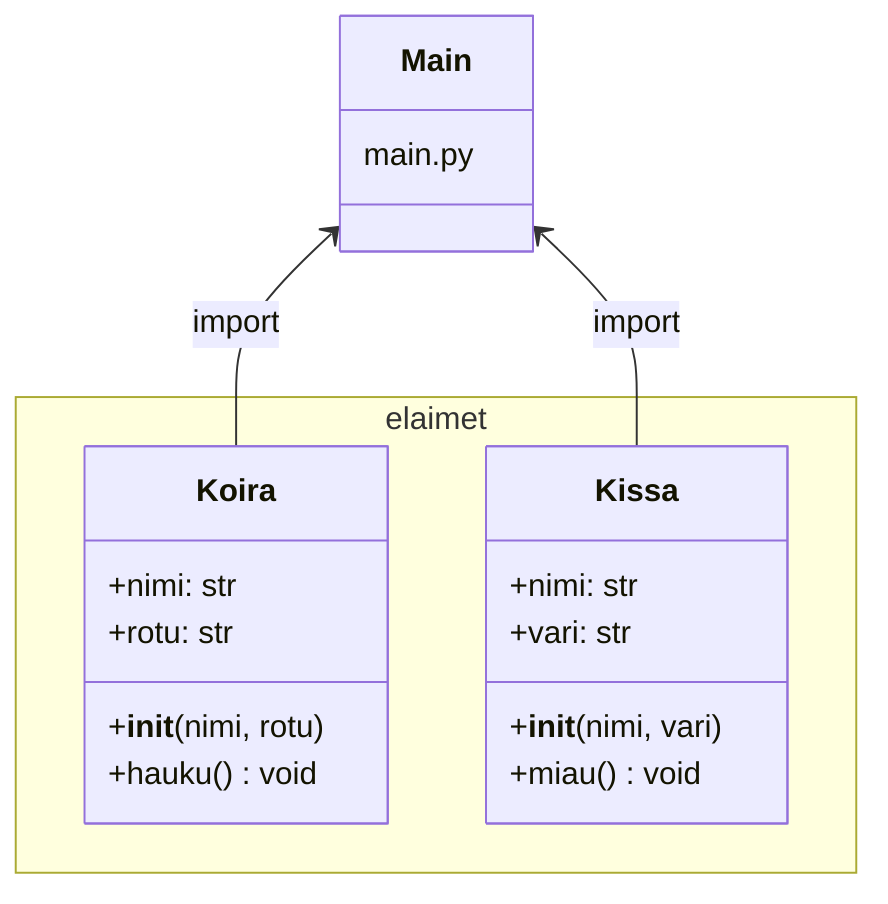

# Moduulit ja paketit

Ohjelman rakenne on tärkeä osa ohjelmiston suunnittelua. Hyvin jäsennelty ohjelma on helpompi ymmärtää, ylläpitää ja laajentaa. Pythonissa ohjelman rakenne voidaan jakaa useisiin osiin, kuten moduuleihin ja paketteihin. Tarve korostuu erityisesti suuremmissa projekteissa, joissa koodia on paljon ja useat kehittäjät työskentelevät yhdessä.

Moduulirakenteen soveltaminen on suositeltavaa kurssin ohjelmointiprojektissa.

## Moduuli

Pythonissa moduuli tarkoittaa yksittäistä tiedostoa, jonka pääte on .py. Moduulin avulla voidaan kirjoittaa funktioita, luokkia ja muuttujia yhteen paikkaan ja käyttää niitä uudelleen toisissa ohjelmissa. Ajatellaan esimerkiksi, että haluamme laskea yhteenlaskuja ja vähennyslaskuja. Voisimme tehdä tiedoston nimeltä `matikka.py`, johon kirjoitamme seuraavat funktiot:

```python
def plus(x, y):
    return x + y

def miinus(x, y):
    return x - y
```

Kun tämä tiedosto on olemassa, voimme ottaa sen käyttöön esimerkiksi pääohjelmassa `import`-lauseella ja kutsua sen funktioita. Tällä tavalla moduuli toimii työkalupakkina, jota voidaan käyttää missä tahansa ohjelmassa:

```python
import matikka
print(matikka.plus(2, 3))  # Tulostaa: 5
```

## Paketti

Jos moduuleja on useampia ja ne halutaan koota yhteen kokonaisuuteen, puhutaan paketista. Paketti on yksinkertaisesti kansio, joka sisältää moduulit ja yleensä myös erityisen tiedoston nimeltä `__init__.py`. Tämä tiedosto voi olla tyhjä, mutta sen olemassaolo kertoo Pythonille, että kyseessä on paketti eikä tavallinen kansio. Paketin avulla voi luoda laajoja kirjastoja, jotka koostuvat useista moduuleista ja jopa alikansioista.

Kuvitellaan esimerkki, jossa teemme paketin nimeltä `elaimet`. Hakemistorakenne voisi näyttää tältä:

```directory
projekti/
│
├── main.py
└── elaimet/           ← paketti
    ├── __init__.py    ← paketin alustus
    ├── koira.py       ← moduuli
    └── kissa.py       ← moduuli
```

Tiedostossa `koira.py` voisi olla funktio:

```python
def hauku():
    print("Hau hau!")
```

Vastaavasti `kissa.py` sisältäisi:

```python
def miau():
    print("Miau!")
```

Tiedostoon `__init__.py` voidaan kirjoittaa:

```python
from .koira import hauku
from .kissa import miau
```

Pythonin versiosta 3.3 lähtien `__init__.py`-tiedosto ei ole enää pakollinen, mutta sen käyttö on suositeltavaa, koska se mahdollistaa paketin sisäisen toiminnan määrittelyn.

Tämän ansiosta paketista voi suoraan tuoda funktiot `hauku` ja `miau`. Tiedostossa `main.py` riittää silloin kirjoittaa:

```python
from elaimet import hauku, miau

hauku()
miau()
```

Kun ohjelma ajetaan, tulostuu ensin koiran haukahdus ja sitten kissan naukaisu. Tämä esimerkki osoittaa, kuinka moduulit ja paketit auttavat ohjelmoijaa järjestämään koodia niin, että siitä tulee selkeämpää, uudelleenkäytettävää ja helpommin hallittavaa.

Myös luokat voidaan määritellä moduuleissa ja paketeissa, mikä mahdollistaa olio-ohjelmoinnin periaatteiden hyödyntämisen suuremmissa ohjelmistoissa. Tämä tekee koodista entistä modulaarisempaa ja helpommin ylläpidettävää.

`koira.py`:

```python
class Koira:
    def __init__(self, nimi, rotu):
        self.nimi = nimi
        self.rotu = rotu

    def hauku(self):
        print(f"{self.nimi} haukkuu: Vuh vuh!")
```

`kissa.py`:

```python
class Kissa:
    def __init__(self, nimi, vari):
        self.nimi = nimi
        self.vari = vari

    def miau(self):
        print(f"{self.nimi} sanoo: Miau!")
```

`__init__.py`:

```python
from .koira import Koira
from .kissa import Kissa
```

Tämän ansiosta voidaan tuoda suoraan `Koira` ja `Kissa`-luokat paketista ilman, että tarvitsee viitata yksittäisiin tiedostoihin.

`main.py`:

```python
from elaimet import Koira, Kissa

koira1 = Koira("Rekku", "Labradori")
kissa1 = Kissa("Misu", "Musta")

koira1.hauku()
kissa1.miau()
```

Kun ohjelma ajetaan, tulostuu:

```output
Rekku haukkuu: Vuh vuh!
Misu sanoo: Miau!
```

Tässä esimerkissä elaimet-paketti sisältää kaksi luokkaa, jotka voidaan helposti ottaa käyttöön pääohjelmassa tai muissa moduuleissa.



Myös yksittäinen moduuli voidaan suorittaa pääohjelmana. Esimerkiksi `koira.py`-tiedosto voidaan suorittaa suoraan, jolloin voidaan testata sen toimintaa ilman koko projektin ajamista. Tällöin moduuliin lisätään seuraava `if`-lause:

```python
class Koira:
    def __init__(self, nimi, rotu):
        self.nimi = nimi
        self.rotu = rotu

    def hauku(self):
        print(f"{self.nimi} haukkuu: Vuh vuh!")

if __name__ == "__main__":
    koira = Koira("TestiRekku", "Labradorin noutaja")
    koira.hauku()
```

Nyt, kun `koira.py` ajetaan suoraan, tulostuu: `TestiRekku haukkuu: Vuh vuh!`. Jos sensijaan moduuli tuodaan käyttöön jossain toisessa ohjelmassa, ei tätä testikoodia suoriteta.

---

<!-- add mermaid support for gh pages -->
<script type="module">
    Array.from(document.getElementsByClassName("language-mermaid")).forEach(element => {
      element.classList.add("mermaid");
    });
    import mermaid from 'https://cdn.jsdelivr.net/npm/mermaid@11/dist/mermaid.esm.min.mjs';
    mermaid.initialize({ startOnLoad: true });
</script>
